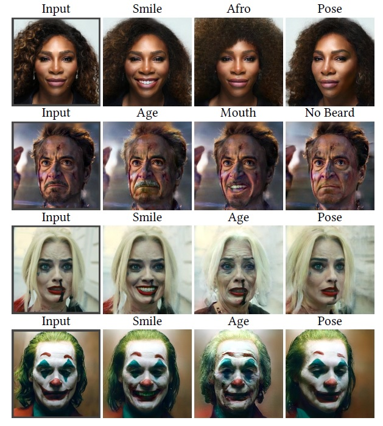
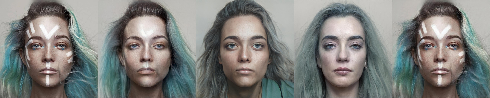
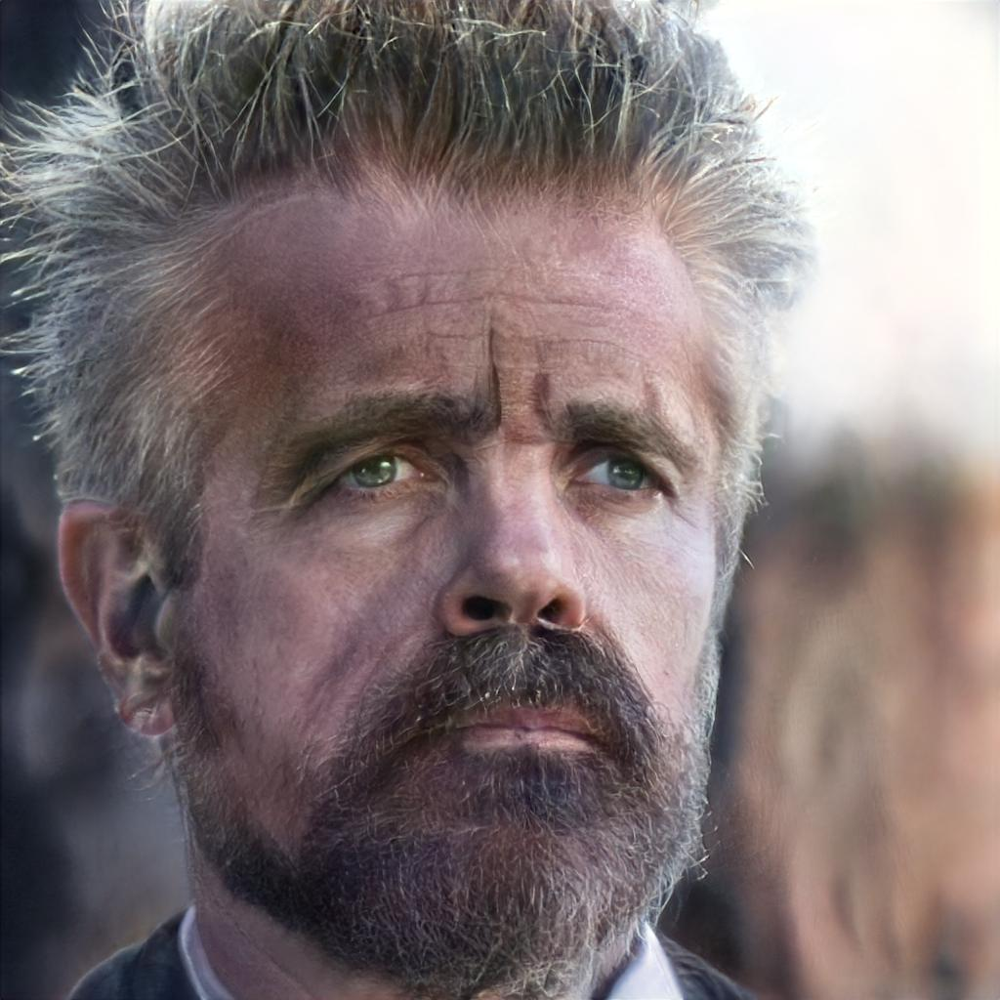

# PTI: Pivotal Tuning for Latent-based editing of Real Images     (ACM TOG 2022)

<!-- > Recently, a surge of advanced facial editing techniques have been proposed
that leverage the generative power of a pre-trained StyleGAN. To successfully
edit an image this way, one must first project (or invert) the image into
the pre-trained generator’s domain. As it turns out, however, StyleGAN’s
latent space induces an inherent tradeoff between distortion and editability,
i.e. between maintaining the original appearance and convincingly altering
some of its attributes. Practically, this means it is still challenging to
apply ID-preserving facial latent-space editing to faces which are out of the
generator’s domain. In this paper, we present an approach to bridge this
gap. Our technique slightly alters the generator, so that an out-of-domain
image is faithfully mapped into an in-domain latent code. The key idea is
pivotal tuning — a brief training process that preserves the editing quality
of an in-domain latent region, while changing its portrayed identity and
appearance. In Pivotal Tuning Inversion (PTI), an initial inverted latent code
serves as a pivot, around which the generator is fined-tuned. At the same
time, a regularization term keeps nearby identities intact, to locally contain
the effect. This surgical training process ends up altering appearance features
that represent mostly identity, without affecting editing capabilities.
To supplement this, we further show that pivotal tuning can also adjust the
generator to accommodate a multitude of faces, while introducing negligible
distortion on the rest of the domain. We validate our technique through
inversion and editing metrics, and show preferable scores to state-of-the-art
methods. We further qualitatively demonstrate our technique by applying
advanced edits (such as pose, age, or expression) to numerous images of
well-known and recognizable identities. Finally, we demonstrate resilience
to harder cases, including heavy make-up, elaborate hairstyles and/or headwear,
which otherwise could not have been successfully inverted and edited
by state-of-the-art methods. -->

<a href="https://arxiv.org/abs/2106.05744"></a>
<a href="https://opensource.org/licenses/MIT"></a>  
Inference Notebook: <a href="https://colab.research.google.com/github/danielroich/PTI/blob/main/notebooks/inference_playground.ipynb"></a>  

<p align="center">
  
<br>
Pivotal Tuning Inversion (PTI) enables employing off-the-shelf latent based
semantic editing techniques on real images using StyleGAN. 
PTI excels in identity preserving edits, portrayed through recognizable figures —
Serena Williams and Robert Downey Jr. (top), and in handling faces which
are clearly out-of-domain, e.g., due to heavy makeup (bottom).
</br>
</p>

## Description   
Official Implementation of our PTI paper + code for evaluation metrics. PTI introduces an optimization mechanizem for solving the StyleGAN inversion task.
Providing near-perfect reconstruction results while maintaining the high editing abilitis of the native StyleGAN latent space W. For more details, see <a href="https://arxiv.org/abs/2106.05744"></a>

## Recent Updates
**2021.07.01**: Fixed files download phase in the inference notebook. Which might caused the notebook not to run smoothly.

**2021.06.29**: Added support for CPU. In order to run PTI on CPU please change `device` parameter under `configs/global_config.py` to "cpu" instead of "cuda".

**2021.06.25** : Adding mohawk edit using StyleCLIP+PTI in inference notebook.
	      Updating documentation in inference notebook due to Google Drive rate limit reached.
	      Currently, Google Drive does not allow to download the pretrined models using Colab automatically. Manual intervention might be needed.

## Getting Started
### Prerequisites
- Linux or macOS
- NVIDIA GPU + CUDA CuDNN (Not mandatory bur recommended)
- Python 3

### Installation
- Dependencies:  
	1. lpips
	2. wandb
	3. pytorch
	4. torchvision
	5. matplotlib
	6. dlib
- All dependencies can be installed using *pip install* and the package name

## Pretrained Models
Please download the pretrained models from the following links.

### Auxiliary Models
We provide various auxiliary models needed for PTI inversion task.  
This includes the StyleGAN generator and pre-trained models used for loss computation.
| Path | Description
| :--- | :----------
|[FFHQ StyleGAN](https://nvlabs-fi-cdn.nvidia.com/stylegan2-ada-pytorch/pretrained/ffhq.pkl) | StyleGAN2-ada model trained on FFHQ with 1024x1024 output resolution.
|[Dlib alignment](https://drive.google.com/file/d/1HKmjg6iXsWr4aFPuU0gBXPGR83wqMzq7/view?usp=sharing) | Dlib alignment used for images preproccessing.
|[FFHQ e4e encoder](https://drive.google.com/file/d/1ALC5CLA89Ouw40TwvxcwebhzWXM5YSCm/view?usp=sharing) | Pretrained e4e encoder. Used for StyleCLIP editing.

Note: The StyleGAN model is used directly from the official [stylegan2-ada-pytorch implementation](https://github.com/NVlabs/stylegan2-ada-pytorch).
For StyleCLIP pretrained mappers, please see [StyleCLIP's official routes](https://github.com/orpatashnik/StyleCLIP/blob/main/utils.py)


By default, we assume that all auxiliary models are downloaded and saved to the directory `pretrained_models`. 
However, you may use your own paths by changing the necessary values in `configs/path_configs.py`. 


## Inversion
### Preparing your Data
In order to invert a real image and edit it you should first align and crop it to the correct size. To do so you should perform *One* of the following steps: 
1. Run `notebooks/align_data.ipynb` and change the "images_path" variable to the raw images path
2. Run `utils/align_data.py` and change the "images_path" variable to the raw images path


### Weights And Biases
The project supports [Weights And Biases](https://wandb.ai/home) framework for experiment tracking. For the inversion task it enables visualization of the losses progression and the generator intermediate results during the initial inversion and the *Pivotal Tuning*(PT) procedure.

The log frequency can be adjusted using the parameters defined at `configs/global_config.py` under the "Logs" subsection.

There is no no need to have an account. However, in order to use the features provided by Weights and Biases you first have to register on their site.


### Running PTI
The main training script is `scripts/run_pti.py`. The script receives aligned and cropped images from paths configured in the "Input info" subscetion in
 `configs/paths_config.py`. 
Results are saved to directories found at "Dirs for output files" under `configs/paths_config.py`. This includes inversion latent codes and tuned generators. 
The hyperparametrs for the inversion task can be found at  `configs/hyperparameters.py`. They are intilized to the default values used in the paper. 

## Editing
By default, we assume that all auxiliary edit directions are downloaded and saved to the directory `editings`. 
However, you may use your own paths by changing the necessary values in `configs/path_configs.py` under "Edit directions" subsection.

Example of editing code can be found at `scripts/latent_editor_wrapper.py`

## Inference Notebooks
To help visualize the results of PTI we provide a Jupyter notebook found in `notebooks/inference_playground.ipynb`.   
The notebook will download the pretrained models and run inference on a sample image found online or 
on images of your choosing. It is recommended to run this in [Google Colab](https://colab.research.google.com/github/danielroich/PTI/blob/main/notebooks/inference_playground.ipynb).

The notebook demonstrates how to:
- Invert an image using PTI
- Visualise the inversion and use the PTI output
- Edit the image after PTI using InterfaceGAN and StyleCLIP
- Compare to other inversion methods

## Evaluation
Currently the repository supports qualitative evaluation for reconstruction of: PTI, SG2 (*W Space*), e4e, SG2Plus (*W+ Space*). 
As well as editing using InterfaceGAN and GANSpace for the same inversion methods.
To run the evaluation please see `evaluation/qualitative_edit_comparison.py`. Examples of the evaluation scripts are:

<p align="center">
  
<br>
Reconsturction comparison between different methods. The images order is: Original image, W+ inversion, e4e inversion, W inversion, PTI inversion
</br>  
</p>

<p align="center">
  
<br>
InterfaceGAN pose edit comparison between different methods. The images order is: Original, W+, e4e, W, PTI
</br>  
</p>

<p align="center">
  

<br>
Image per edit or several edits without comparison
</br>  
</p>

###  Coming Soon - Quantitative evaluation and StyleCLIP qualitative evaluation

## Repository structure
| Path | Description 
| :--- | :---
| &boxvr;&nbsp; configs | Folder containing configs defining Hyperparameters, paths and logging
| &boxvr;&nbsp; criteria | Folder containing various loss and regularization criterias for the optimization
| &boxvr;&nbsp; dnnlib | Folder containing internal utils for StyleGAN2-ada
| &boxvr;&nbsp; docs | Folder containing the latent space edit directions
| &boxvr;&nbsp; editings | Folder containing images displayed in the README
| &boxvr;&nbsp; environment | Folder containing Anaconda environment used in our experiments
| &boxvr;&nbsp; licenses | Folder containing licenses of the open source projects used in this repository
| &boxvr;&nbsp; models | Folder containing models used in different editing techniques and first phase inversion
| &boxvr;&nbsp; notebooks | Folder with jupyter notebooks to demonstrate the usage of PTI end-to-end
| &boxvr;&nbsp; scripts | Folder with running scripts for inversion, editing and metric computations
| &boxvr;&nbsp; torch_utils | Folder containing internal utils for StyleGAN2-ada
| &boxvr;&nbsp; training | Folder containing the core training logic of PTI
| &boxvr;&nbsp; utils | Folder with various utility functions


## Credits
**StyleGAN2-ada model and implementation:**  
https://github.com/NVlabs/stylegan2-ada-pytorch
Copyright © 2021, NVIDIA Corporation.  
Nvidia Source Code License https://nvlabs.github.io/stylegan2-ada-pytorch/license.html

**LPIPS model and implementation:**  
https://github.com/richzhang/PerceptualSimilarity  
Copyright (c) 2020, Sou Uchida  
License (BSD 2-Clause) https://github.com/richzhang/PerceptualSimilarity/blob/master/LICENSE

**e4e model and implementation:**   
https://github.com/omertov/encoder4editing
Copyright (c) 2021 omertov  
License (MIT) https://github.com/omertov/encoder4editing/blob/main/LICENSE

**StyleCLIP model and implementation:**   
https://github.com/orpatashnik/StyleCLIP
Copyright (c) 2021 orpatashnik  
License (MIT) https://github.com/orpatashnik/StyleCLIP/blob/main/LICENSE

**InterfaceGAN implementation:**   
https://github.com/genforce/interfacegan
Copyright (c) 2020 genforce  
License (MIT) https://github.com/genforce/interfacegan/blob/master/LICENSE

**GANSpace implementation:**   
https://github.com/harskish/ganspace
Copyright (c) 2020 harkish  
License (Apache License 2.0) https://github.com/harskish/ganspace/blob/master/LICENSE


## Acknowledgments
This repository structure is based on [encoder4editing](https://github.com/omertov/encoder4editing) and [ReStyle](https://github.com/yuval-alaluf/restyle-encoder) repositories

## Contact
For any inquiry please contact us at our email addresses: danielroich@gmail.com or ron.mokady@gmail.com


## Citation
If you use this code for your research, please cite:
```
@article{roich2021pivotal,
  title={Pivotal Tuning for Latent-based Editing of Real Images},
  author={Roich, Daniel and Mokady, Ron and Bermano, Amit H and Cohen-Or, Daniel},
  journal={arXiv preprint arXiv:2106.05744},
  year={2021}
}
```
